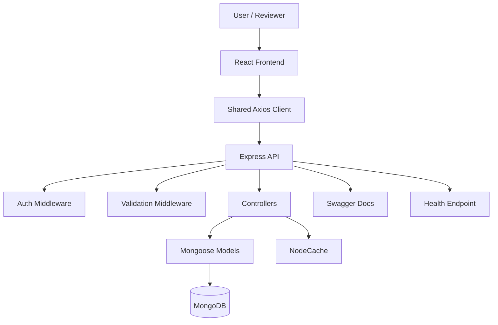
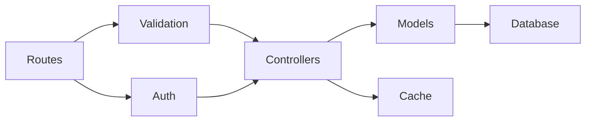
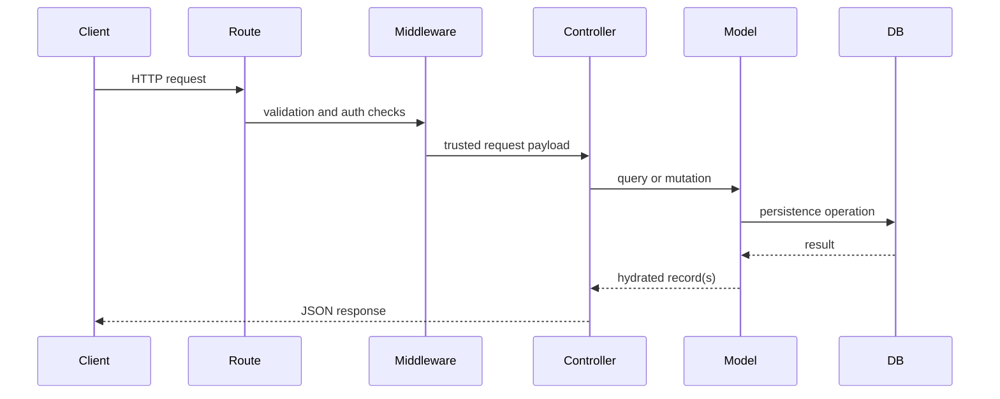
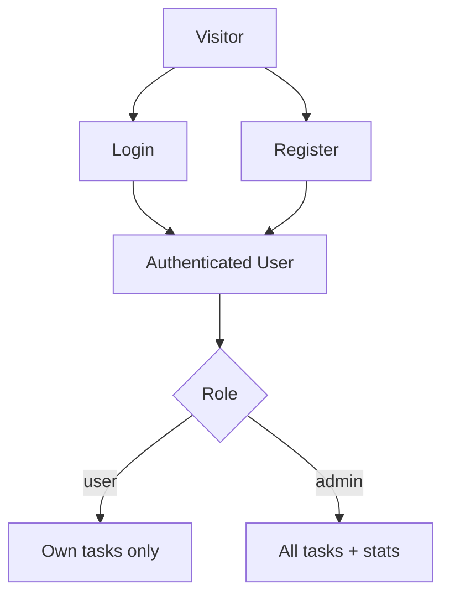
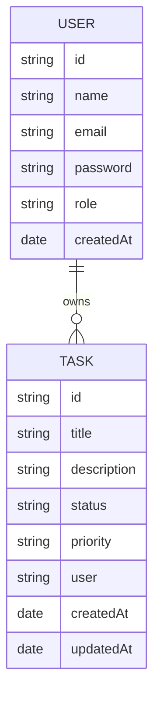

# Architecture Guide

This document explains how the system is organized, how requests move through it, and which design choices were made intentionally for clarity, maintainability, and reviewer readability.

## Architectural Positioning

The project is implemented as a **modular monolith**:

- one backend service
- clear separation of routing, middleware, controllers, and models
- enough structure to show production-style engineering decisions
- simple local setup without unnecessary distributed complexity

This is the right fit for the problem size and for an assignment-oriented repository that still aims to demonstrate maturity.

## System Overview

## Backend Responsibility Map

## Folder-Level Responsibilities

### Backend

| Path | Responsibility |
| --- | --- |
| `backend/server.js` | application bootstrap, middleware registration, route mounting |
| `backend/config/db.js` | database connection with fallback behavior |
| `backend/routes` | HTTP surface and route composition |
| `backend/controllers` | request orchestration and domain actions |
| `backend/middleware` | auth, validation, and error handling policies |
| `backend/models` | schema definitions and persistence constraints |

### Frontend

| Path | Responsibility |
| --- | --- |
| `frontend/src/App.jsx` | route composition |
| `frontend/src/context/AuthContext.jsx` | auth state and auth actions |
| `frontend/src/lib/api.js` | Axios instance and token injection |
| `frontend/src/pages` | route-level screens |
| `frontend/src/utils/form.js` | input sanitization and API error extraction |

## Request Lifecycle

## Auth and Access Model

### Effective authorization rules

- all authenticated users can create tasks
- standard users can only read, update, and delete their own tasks
- admins can access all tasks
- admins can access aggregated task statistics
- admin registration requires a configured secret code

## Data Model

## Runtime Concerns

### Validation

- route-level validation uses `express-validator`
- validation happens before controller execution
- schema validation remains at the Mongoose layer as a second boundary

### Error handling

- unmatched routes flow into `notFound` middleware
- runtime errors flow into centralized error middleware
- common cases such as duplicate keys, invalid IDs, and JWT failures are normalized into predictable API responses

### Caching

- task list responses are cached in-memory for short periods
- task mutations clear relevant cache entries
- this improves demo responsiveness without introducing external infrastructure

## Frontend Role In The Architecture

The frontend is intentionally compact. Its responsibility is not to act as a design system showcase, but to prove the backend in realistic user flows:

- auth state rehydration
- token propagation to API requests
- protected navigation
- task CRUD interactions
- admin-specific visibility on the dashboard

## Trade-Offs

### Why not split services?

For this scope, splitting auth and task domains into separate deployables would increase complexity without improving clarity. The modular monolith keeps boundaries visible while staying easy to review and run locally.

### Why not use refresh tokens and cookies?

That would be a good next step for a production deployment, but it would add additional moving parts that are not necessary to demonstrate the core backend design goals here.

### Why include an in-memory database fallback?

Reviewer convenience. It reduces the odds of a full local startup failure when MongoDB is unavailable and keeps the project easier to evaluate.

## Clean Next Evolutions

If this project were extended, the most natural next steps would be:

- add backend integration tests around auth and task flows
- add frontend tests around auth and dashboard behavior
- replace in-process cache with Redis for multi-instance deployments
- introduce structured logging and request correlation IDs
- move token handling toward `httpOnly` cookie-based auth
- externalize deployment concerns into environment-specific manifests

