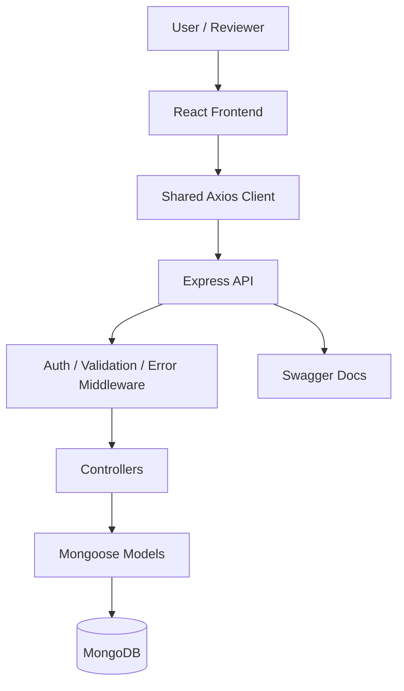
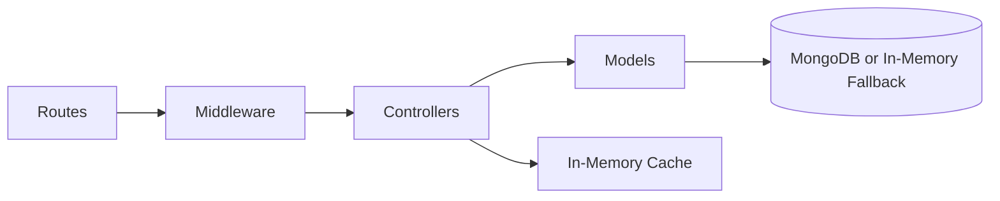
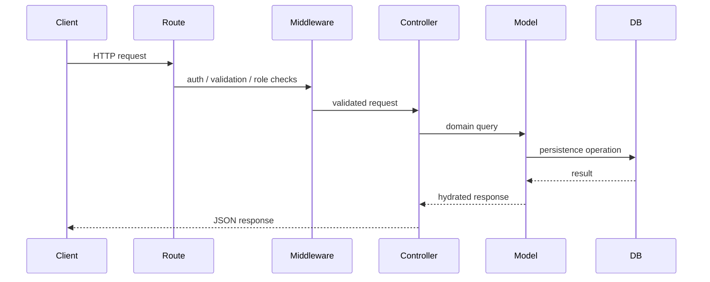
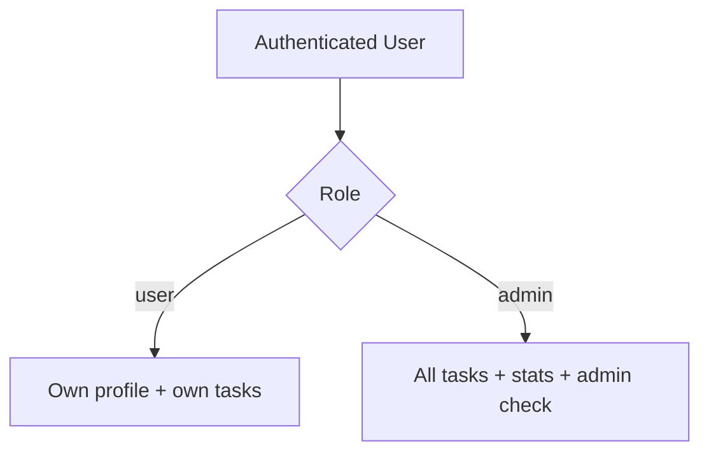
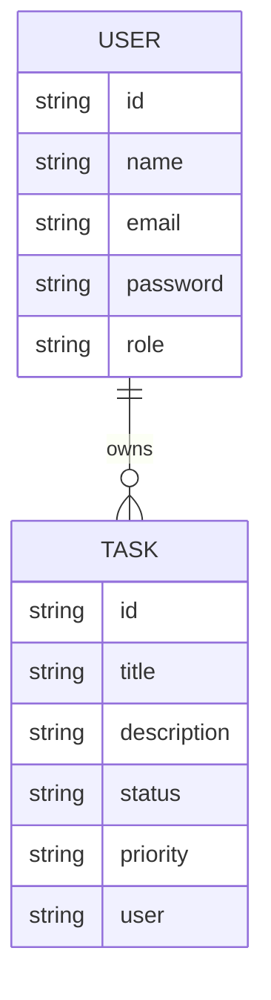

# Architecture Guide

This document explains how the project is structured, how requests move through the system, and which design decisions were chosen intentionally for maintainability and reviewer clarity.

## Architectural Intent

The assignment is built as a modular monolith. That means:

- a single deployable backend service
- clearly separated routes, controllers, middleware, and models
- production-style concerns handled inside the monolith
- easy future evolution into service boundaries if needed

This is a practical choice for an assignment because it keeps the system simple to run while still demonstrating sound backend engineering practices.

## High-Level System Diagram

## Backend Responsibility Map

### Routes

Routes define public API surface area and attach middleware chains.

- `authRoutes.js`: registration, login, current user, admin access check
- `taskRoutes.js`: task CRUD and stats
- `healthRoutes.js`: health endpoint for basic operational visibility

### Middleware

Middleware is used as a reusable policy layer.

- `auth.js`: JWT verification and role authorization
- `validate.js`: validation result handling
- `validators.js`: request validation rules
- `error.js`: centralized error responses
- `notFound.js`: unmatched route handling

### Controllers

Controllers coordinate request handling and domain behavior.

- `authController.js`: register, login, current user
- `taskController.js`: task CRUD, stats, filtering, pagination, caching
- `healthController.js`: health response

### Models

Models describe persistence structure and database-level validation.

- `User.js`
- `Task.js`

## Request Lifecycle

## Role-Based Access Model

### Effective Rules

- all authenticated users can create and manage their own tasks
- only admins can access task statistics
- only admins can pass the explicit admin check route
- task ownership is enforced at controller level for read/update/delete

## Data Model

## Frontend Structure

The frontend intentionally stays lightweight because the assignment prioritizes backend implementation. Even so, it follows clear separation of concerns:

- `pages/`: route-level screens
- `context/`: authentication state and auth operations
- `lib/`: shared API client and API base URL management
- `utils/`: sanitization and API error helpers

## Tradeoffs

### Why a modular monolith?

- simple to review
- easy to run locally
- enough structure to show backend maturity
- avoids unnecessary complexity for an assignment-sized scope

### Why in-memory MongoDB fallback?

- improves local demo reliability
- avoids complete startup failure when MongoDB is unavailable
- useful for reviewers who want a quick run

### Why session storage on frontend?

- easy to demonstrate JWT-protected flows
- simpler than full cookie-based auth setup for assignment scope

For production, `httpOnly` cookies would generally be stronger.

## Future-Friendly Structure

If this project were expanded further, the next clean evolutions would be:

- introduce service layer modules for business logic
- add test directories for backend and frontend
- swap in Redis for shared caching
- add refresh tokens and cookie-based auth
- extract auth and task modules into independent services if scale justified it

