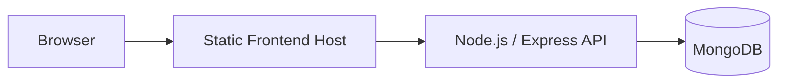

# Deployment Notes

This repository is configured primarily for local review and interview evaluation, but the structure is close to a straightforward deployment on any standard Node.js hosting stack.

## Services

- **Backend**: Express API
- **Frontend**: Vite-built static application
- **Database**: MongoDB

## Environment Variables

### Backend

Use [backend/.env.example](./backend/.env.example) as the reference:

```env
PORT=5000
NODE_ENV=development
MONGO_URI=mongodb://localhost:27017/primetrade_tasks
JWT_SECRET=replace_with_a_long_random_secret
ADMIN_SECRET_CODE=replace_with_admin_signup_code
```

### Frontend

Use [frontend/.env.example](./frontend/.env.example) if the backend URL differs from local development:

```env
VITE_API_URL=http://localhost:5000/api/v1
```

## Local Deployment Flow

### Backend

```bash
cd backend
npm install
npm run dev
```

### Frontend

```bash
cd frontend
npm install
npm run build
```

The frontend build output is generated in `frontend/dist`.

## Production-Oriented Deployment Shape



## Practical Hosting Options

### Backend

- Render
- Railway
- Fly.io
- AWS Elastic Beanstalk / ECS
- any VPS with Node.js and a reverse proxy

### Frontend

- Vercel
- Netlify
- Cloudflare Pages
- static asset hosting behind Nginx

### Database

- MongoDB Atlas
- self-hosted MongoDB

## Deployment Considerations

- use a managed MongoDB instance instead of the in-memory fallback
- replace development secrets with real environment-managed secrets
- run the CI workflow before deployment
- point `VITE_API_URL` at the deployed backend base URL
- prefer HTTPS and secure cookie-based auth for a production version

## Recommended Production Hardening

- add rate limiting
- add structured logging
- move token handling to `httpOnly` cookies
- add monitoring and alerts
- replace in-process cache with Redis if running multiple API instances

