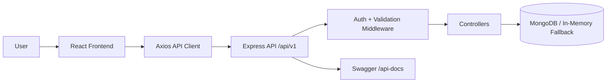
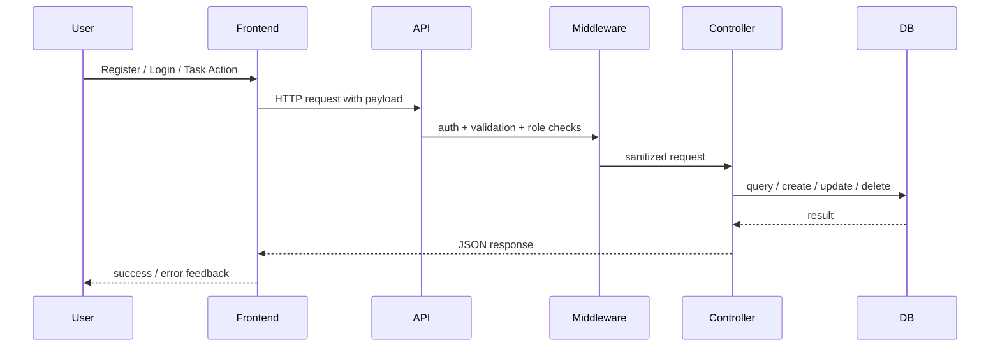

# Primetrade Assignment: Secure Task Management Platform

This project is a production-oriented full-stack assignment built around a secure REST API and a lightweight frontend for API consumption. The backend is the primary focus and emphasizes modular design, authentication, role-based authorization, validation, documentation, and operational resilience. The frontend exists to demonstrate real user flows against the API, including authentication, protected access, and CRUD interactions.

## Overview

The application supports:

- user registration and login with password hashing
- JWT-based authentication
- role-based access control for `user` and `admin`
- CRUD operations for a secondary entity: `tasks`
- filtering, sorting, and pagination for task listing
- request validation and centralized error handling
- Swagger and Postman API documentation
- React frontend for register, login, protected dashboard access, and task CRUD
- fallback in-memory MongoDB support for development and demo resilience

## Architecture

The backend follows a modular Express + Mongoose structure:

```text
backend/
  config/         database connection
  controllers/    request handlers
  middleware/     auth, validation, error, notFound
  models/         Mongoose schemas
  routes/         feature routes
```

The frontend is organized for separation of concerns:

```text
frontend/
  src/
    context/      authentication state management
    lib/          shared API client
    pages/        route-level pages
    utils/        sanitization and API error helpers
```

### System Flow



### Request Lifecycle



## Key Features

### Backend

- Modular Express API with versioned routes under `/api/v1`
- JWT authentication with `bcryptjs` password hashing
- Role-based authorization for `user` and `admin`
- Task CRUD with ownership checks
- Filtering, sorting, pagination, and admin statistics
- Centralized validation using `express-validator`
- Centralized error handling and 404 route handling
- Health check endpoint at `/api/v1/health`
- Swagger docs at `/api-docs`
- Postman collection included in the repository

### Frontend

- React + Vite single-page application
- Register and login flows
- Protected dashboard route
- Task create, edit, delete, and list UI
- Success and error messaging driven by API responses
- Shared API client with centralized JWT attachment
- Environment-based API URL configuration using `VITE_API_URL`

## Authentication and Authorization

### Authentication

- Passwords are hashed before persistence using `bcryptjs`
- JWT tokens are returned on successful login and registration
- Protected routes require a valid bearer token

### Authorization

- `user` accounts can access and manage only their own tasks
- `admin` accounts can inspect all tasks and use admin-only endpoints such as:
  - `GET /api/v1/auth/admin-check`
  - `GET /api/v1/tasks/stats`

## API Documentation

- Swagger UI: `http://localhost:5000/api-docs`
- Postman collection: `backend/Primetrade-API.postman_collection.json`
- Architecture notes: `ARCHITECTURE.md`
- Reviewer quick path: `REVIEWER_GUIDE.md`

## Demo and Access Links

- Local frontend: `http://127.0.0.1:5173`
- Local Swagger docs: `http://localhost:5000/api-docs`
- Local health check: `http://localhost:5000/api/v1/health`
- Hosted demo: not deployed as part of this assignment repository

## Environment Configuration

### Backend

Create `backend/.env` from `backend/.env.example`:

```env
PORT=5000
NODE_ENV=development
MONGO_URI=mongodb://localhost:27017/primetrade_tasks
JWT_SECRET=replace_with_a_long_random_secret
ADMIN_SECRET_CODE=replace_with_admin_signup_code
```

### Frontend

Create `frontend/.env` from `frontend/.env.example` if you want to override the default API URL:

```env
VITE_API_URL=http://localhost:5000/api/v1
```

## Running the Project

## 1. Install dependencies

Backend:

```bash
cd backend
npm install
```

Frontend:

```bash
cd frontend
npm install
```

## 2. Start the database

### Option A: Local MongoDB

Run MongoDB locally so that `MONGO_URI=mongodb://localhost:27017/primetrade_tasks` is reachable.

### Option B: Docker

If Docker Desktop is installed, run from the project root:

```bash
docker-compose up -d
```

## 3. Start the backend

```bash
cd backend
npm run dev
```

Expected successful startup:

```text
MongoDB Connected: localhost
Server running in development mode on port 5000
```

If MongoDB is unavailable, the backend will fall back to an in-memory MongoDB instance:

```text
Failed to connect to primary MongoDB. Spinning up In-Memory DB...
In-Memory MongoDB Connected: 127.0.0.1
```

This fallback is useful for local demos, but it is temporary and non-persistent.

## 4. Start the frontend

```bash
cd frontend
npm run dev
```

The frontend typically runs at:

`http://127.0.0.1:5173`

## 5. Use the application

- App UI: `http://127.0.0.1:5173`
- Swagger docs: `http://localhost:5000/api-docs`
- Health check: `http://localhost:5000/api/v1/health`

## Reviewer Flow

If you are reviewing the project for the first time, the fastest path is:

1. Read this README for scope and tradeoffs
2. Open Swagger docs to inspect the API surface
3. Run the frontend and verify auth + task flows
4. Read `ARCHITECTURE.md` for system design details
5. Use `REVIEWER_GUIDE.md` for a focused evaluation path

## Admin Signup

To create an admin account:

- choose `Admin` during registration
- provide the same value configured in `ADMIN_SECRET_CODE`

If the code does not match, admin registration is rejected.

## Security Considerations

- Password hashing with `bcryptjs`
- JWT-protected routes for authenticated access
- Role-based route protection and resource ownership checks
- Request validation using `express-validator`
- Centralized API error responses
- Helmet-based security headers
- Session storage token handling on the frontend for a simpler demo flow

Note:
For a production deployment, `httpOnly` secure cookies would generally be preferable to browser-managed storage for token handling.

## Validation and Error Handling Strategy

- request validation runs before controller execution through reusable validator middleware
- model-level validation still exists at the schema layer as a second line of defense
- controller logic focuses on domain actions and authorization checks
- centralized error middleware converts runtime failures into consistent JSON responses
- unmatched routes are handled by a dedicated `notFound` middleware

## Scalability Considerations

The codebase was designed with incremental scalability in mind:

- versioned API routes
- modular route/controller/middleware separation
- reusable validation middleware
- environment-based configuration
- API documentation for easier onboarding
- caching support already included for task queries
- Docker-based database setup support

See [SCALABILITY.md](./SCALABILITY.md) for a short note on future scaling directions such as microservices, distributed caching, and load balancing.
See `ARCHITECTURE.md` for implementation-level structure and request flow.

## Tradeoffs and Practical Decisions

- MongoDB in-memory fallback was included to improve local reliability and demo readiness
- The frontend intentionally remains simple because the assignment prioritizes backend design
- The code aims for clarity and maintainability over unnecessary abstraction

## Suggested Future Improvements

- refresh token flow with rotation
- `httpOnly` cookie-based auth
- automated backend and frontend tests
- Redis-backed distributed caching
- request correlation IDs and structured logs
- CI/CD pipeline and deployment configuration
- persistent production database and secrets management

## Deliverables Mapping

- Backend project hosted in GitHub with README setup: complete
- Working APIs for authentication and CRUD: complete
- Basic frontend UI that connects to APIs: complete
- API documentation (Swagger/Postman collection): complete
- Short scalability note: complete

## Supporting Documents

- `ARCHITECTURE.md`
- `REVIEWER_GUIDE.md`
- `SCALABILITY.md`
