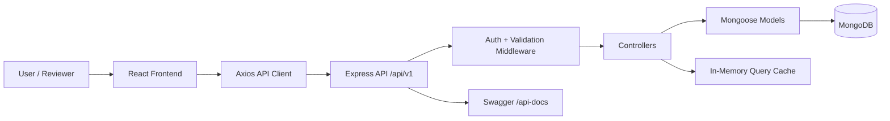
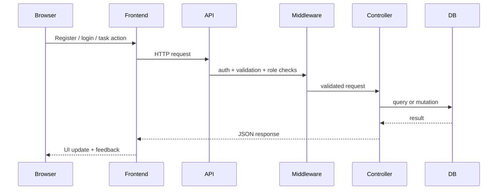

# Primetrade Task Platform

[](https://github.com/adarshkshitij/Assignment/actions/workflows/ci.yml)

Backend-first full-stack task management platform built to demonstrate production-minded API design, reviewer-friendly documentation, and a clean end-to-end implementation of authentication, authorization, validation, and task workflows.

This repository is strongest as a **full-stack project with a backend engineering emphasis**. The frontend is intentionally lightweight and supports the core reviewer journey: register, sign in, access protected routes, and exercise task CRUD and admin-only flows against the API.

## What This Project Does

Primetrade Task Platform solves a common operational problem: teams need a secure way to manage tasks with user-level ownership, admin visibility, clear validation, and predictable API behavior.

The project demonstrates:

- JWT-based authentication and protected routes
- role-based access control for `user` and `admin`
- task CRUD with ownership enforcement
- filtering, sorting, pagination, and admin-facing task statistics
- centralized request validation and error handling
- Swagger and Postman API documentation
- a small React frontend that exercises the backend through real flows

## Why This Repo Is Worth Reviewing

This project is structured to be easy to understand quickly:

- the backend follows a modular Express architecture
- request flow is explicit and documented
- validation and authorization are separated into reusable middleware
- operational and reviewer docs are included
- CI verifies backend syntax and frontend production build
- local setup supports both MongoDB and a development-friendly in-memory fallback

## Stack

### Backend

- Node.js
- Express
- MongoDB + Mongoose
- JWT authentication
- `bcryptjs`
- `express-validator`
- Swagger (`swagger-jsdoc`, `swagger-ui-express`)
- `node-cache`

### Frontend

- React
- Vite
- Axios
- React Router

### Tooling

- GitHub Actions CI
- Docker Compose for local MongoDB
- Postman collection for API exploration

## One-Look Architecture



## Request Lifecycle



## Repository Map

| Path | Responsibility |
| --- | --- |
| `backend/config` | environment-aware database connection |
| `backend/controllers` | route handlers and business flow |
| `backend/middleware` | auth, validation, error handling |
| `backend/models` | Mongoose schemas and persistence rules |
| `backend/routes` | versioned API surface |
| `frontend/src/context` | auth state and auth operations |
| `frontend/src/lib` | shared API client and token handling |
| `frontend/src/pages` | route-level UI screens |
| `.github/workflows` | CI verification |
| `ARCHITECTURE.md` | system design and flow |
| `REVIEWER_GUIDE.md` | fastest way to evaluate the repo |
| `OPERATIONS.md` | runtime, health, and troubleshooting notes |
| `DEPLOYMENT.md` | environment and deployment guidance |
| `DESIGN_NOTES.md` | design choices and trade-offs |

## Reviewer Quick Start

If you want the fastest high-signal evaluation path:

1. Read this README for scope and structure.
2. Open [REVIEWER_GUIDE.md](./REVIEWER_GUIDE.md).
3. Review [ARCHITECTURE.md](./ARCHITECTURE.md) for the system flow.
4. Inspect [backend/server.js](./backend/server.js) and [backend/controllers/taskController.js](./backend/controllers/taskController.js).
5. Run the app locally and open Swagger at `http://localhost:5000/api-docs`.

## Local Setup

### Prerequisites

- Node.js 18+ recommended
- npm
- MongoDB locally, MongoDB Atlas, or Docker Desktop

### 1. Clone the repository

```bash
git clone https://github.com/adarshkshitij/Assignment.git
cd Assignment
```

### 2. Configure environment variables

Backend configuration lives in `backend/.env`.

You can start from [backend/.env.example](./backend/.env.example):

```env
PORT=5000
NODE_ENV=development
MONGO_URI=mongodb://localhost:27017/primetrade_tasks
JWT_SECRET=replace_with_a_long_random_secret
ADMIN_SECRET_CODE=replace_with_admin_signup_code
```

Frontend overrides are optional. If needed, use [frontend/.env.example](./frontend/.env.example):

```env
VITE_API_URL=http://localhost:5000/api/v1
```

### 3. Start the database

Option A: run MongoDB locally and point `MONGO_URI` to it.

Option B: start MongoDB via Docker:

```bash
docker-compose up -d
```

### 4. Install dependencies and run the services

Backend:

```bash
cd backend
npm install
npm run dev
```

Frontend:

```bash
cd frontend
npm install
npm run dev
```

### 5. Open the application

- Frontend: `http://127.0.0.1:5173`
- Swagger docs: `http://localhost:5000/api-docs`
- Health endpoint: `http://localhost:5000/api/v1/health`

## Demo Flows

### User flow

- register a standard `user`
- sign in
- create, edit, filter, and delete personal tasks
- review status and priority metrics on the dashboard

### Admin flow

- register as `admin`
- provide the configured `ADMIN_SECRET_CODE`
- access cross-user task visibility and task statistics

## API Surface

### Auth

- `POST /api/v1/auth/register`
- `POST /api/v1/auth/login`
- `GET /api/v1/auth/me`
- `GET /api/v1/auth/admin-check`

### Tasks

- `GET /api/v1/tasks`
- `POST /api/v1/tasks`
- `GET /api/v1/tasks/:id`
- `PUT /api/v1/tasks/:id`
- `DELETE /api/v1/tasks/:id`
- `GET /api/v1/tasks/stats`

### System

- `GET /api/v1/health`

## Engineering Quality Signals

- modular backend with explicit route/controller/middleware boundaries
- reusable request validators via `express-validator`
- centralized error handling and not-found middleware
- role-based authorization and ownership checks
- frontend API client with token injection and auth reset on `401`
- Swagger and Postman documentation for API review
- CI that runs backend verification and frontend production build
- environment example files checked into the repo

## Key Design Decisions

- **Backend-first scope:** the assignment is evaluated primarily on backend depth, so the frontend is intentionally minimal but complete enough to prove the API works.
- **Modular monolith:** this keeps the system simple to run while still showing scalable code organization.
- **In-memory MongoDB fallback:** improves demo resilience when a reviewer does not have MongoDB running locally.
- **Session storage for tokens:** acceptable for demo scope, with `httpOnly` cookies noted as a production improvement.

For a deeper explanation, see [DESIGN_NOTES.md](./DESIGN_NOTES.md).

## Verification

Backend verification:

```bash
cd backend
npm run check
```

Frontend production build:

```bash
cd frontend
npm run build
```

CI runs both of the above on pushes and pull requests via [`.github/workflows/ci.yml`](./.github/workflows/ci.yml).

## Additional Documentation

- [ARCHITECTURE.md](./ARCHITECTURE.md)
- [REVIEWER_GUIDE.md](./REVIEWER_GUIDE.md)
- [OPERATIONS.md](./OPERATIONS.md)
- [DEPLOYMENT.md](./DEPLOYMENT.md)
- [DESIGN_NOTES.md](./DESIGN_NOTES.md)
- [SCALABILITY.md](./SCALABILITY.md)

## Future Improvements

- automated backend integration tests
- frontend component and interaction tests
- refresh-token flow with rotation
- `httpOnly` cookie-based auth
- structured logging and correlation IDs
- Redis-backed cache for multi-instance deployments
- production deployment manifests and secrets management

## Repository Positioning

This is a **backend-first full-stack engineering project** that is strongest when presented as:

- secure task management platform
- production-style Express API with reviewer-friendly documentation
- practical demonstration of auth, RBAC, validation, CRUD, and API ergonomics

