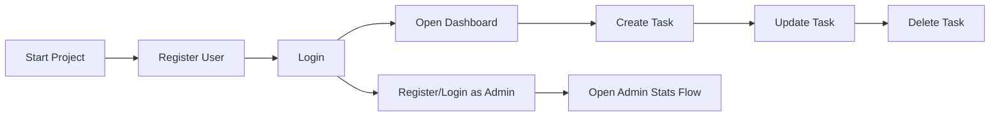

# Reviewer Guide

This guide is intended to help a reviewer or interviewer evaluate the project quickly without having to inspect every file manually.

## What This Project Demonstrates

- secure user registration and login
- JWT-based authentication
- role-based access control
- task CRUD with ownership checks
- filtering, sorting, and pagination
- validation and centralized error handling
- Swagger and Postman documentation
- frontend integration with protected routes

## Fastest Review Path

If you only have 5 to 10 minutes, use this order:

1. Read [README.md](./README.md)
2. Open Swagger at `http://localhost:5000/api-docs`
3. Inspect backend entry point in [server.js](./backend/server.js)
4. Review auth flow in [authController.js](./backend/controllers/authController.js)
5. Review authorization and validation in:
   - [auth.js](./backend/middleware/auth.js)
   - [validators.js](./backend/middleware/validators.js)
6. Review task workflows in [taskController.js](./backend/controllers/taskController.js)
7. Review frontend integration in:
   - [AuthContext.jsx](./frontend/src/context/AuthContext.jsx)
   - [Dashboard.jsx](./frontend/src/pages/Dashboard.jsx)

## What To Look For

### Backend signals

- API versioning under `/api/v1`
- reusable middleware
- validation before controller execution
- centralized error handling
- clear user/admin separation
- ownership checks on tasks
- API docs and reviewer-friendly setup

### Frontend signals

- protected route handling
- auth state rehydration
- shared API client
- clear API success and error UX
- minimal but purposeful structure

## Suggested Demo Flow



## Reviewer Notes

- If local MongoDB is unavailable, the backend falls back to an in-memory MongoDB instance for demo continuity.
- The frontend is intentionally simple because the assignment prioritizes backend depth.
- The codebase avoids overengineering but still shows modular, production-minded patterns.

## Verification Commands

Backend syntax check:

```bash
cd backend
npm run check
```

Frontend production build:

```bash
cd frontend
npm run build
```

## Artifacts

- Swagger docs: `http://localhost:5000/api-docs`
- Postman collection: `backend/Primetrade-API.postman_collection.json`
- Scalability note: [SCALABILITY.md](./SCALABILITY.md)
- Architecture notes: [ARCHITECTURE.md](./ARCHITECTURE.md)
