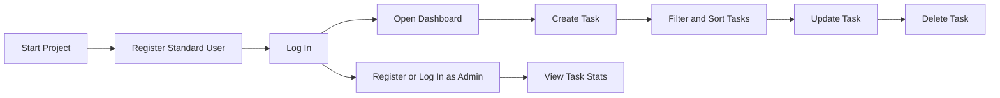

# Reviewer Guide

This guide is designed for recruiters, interviewers, hiring managers, and developers who want a fast, high-signal walkthrough of the repository without reading every file.

## Project Classification

Best fit: **backend-first full-stack project**

Why:

- the backend contains the primary engineering depth
- the frontend exists to validate real user and admin flows
- the repository demonstrates API design, auth, RBAC, validation, and operational documentation in one place

## What To Evaluate First

If you only have 5 to 10 minutes, use this path:

1. Read [README.md](./README.md) for the overall scope and quality signals.
2. Open [ARCHITECTURE.md](./ARCHITECTURE.md) for a quick system understanding.
3. Inspect [backend/server.js](./backend/server.js) to see application bootstrap and middleware composition.
4. Inspect [backend/controllers/authController.js](./backend/controllers/authController.js) and [backend/controllers/taskController.js](./backend/controllers/taskController.js).
5. Inspect [backend/middleware/auth.js](./backend/middleware/auth.js) and [backend/middleware/validators.js](./backend/middleware/validators.js).
6. Inspect [frontend/src/context/AuthContext.jsx](./frontend/src/context/AuthContext.jsx) and [frontend/src/pages/Dashboard.jsx](./frontend/src/pages/Dashboard.jsx).
7. Run the project and review Swagger at `http://localhost:5000/api-docs`.

## What This Repository Demonstrates

- modular Express backend organization
- JWT authentication with password hashing
- role-based access control
- task ownership enforcement
- validation before controller execution
- centralized error handling
- API documentation via Swagger and Postman
- frontend integration with protected flows
- CI verification for backend and frontend

## Suggested Review Lens

### Backend quality signals

- route/controller/middleware separation
- request validation and model validation
- ownership and authorization checks
- explicit admin-only capability boundaries
- health endpoint and predictable startup behavior

### Frontend quality signals

- shared API client with token injection
- auth state rehydration
- meaningful task dashboard interactions
- user-facing handling of API success and error cases

### Documentation quality signals

- quick repository comprehension
- architecture and operations notes
- reviewer-oriented entry points
- realistic trade-offs instead of overclaiming

## Suggested Demo Journey



## Files Worth Opening

| File | Why it matters |
| --- | --- |
| [backend/server.js](./backend/server.js) | service bootstrap and middleware wiring |
| [backend/config/db.js](./backend/config/db.js) | persistence strategy and in-memory fallback |
| [backend/controllers/authController.js](./backend/controllers/authController.js) | auth flow and token issuance |
| [backend/controllers/taskController.js](./backend/controllers/taskController.js) | CRUD, filtering, pagination, cache invalidation |
| [backend/middleware/auth.js](./backend/middleware/auth.js) | auth and RBAC enforcement |
| [backend/middleware/validators.js](./backend/middleware/validators.js) | input validation boundary |
| [frontend/src/context/AuthContext.jsx](./frontend/src/context/AuthContext.jsx) | frontend auth orchestration |
| [frontend/src/lib/api.js](./frontend/src/lib/api.js) | API client configuration and token handling |
| [frontend/src/pages/Dashboard.jsx](./frontend/src/pages/Dashboard.jsx) | core user-visible flow |

## Verification Commands

Backend verification:

```bash
cd backend
npm run check
```

Frontend production build:

```bash
cd frontend
npm run build
```

## Additional Supporting Docs

- [OPERATIONS.md](./OPERATIONS.md)
- [DEPLOYMENT.md](./DEPLOYMENT.md)
- [DESIGN_NOTES.md](./DESIGN_NOTES.md)
- [SCALABILITY.md](./SCALABILITY.md)

