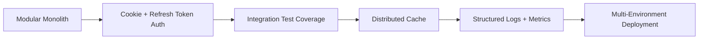

# Scalability Notes

This project is intentionally implemented as a modular monolith, which is the right choice for its size and review context. The codebase is small enough to stay easy to run locally, but the internal structure already supports cleaner growth than a flat prototype would.

## Current Scalability Strengths

- versioned API routes under `/api/v1`
- modular separation of routes, middleware, controllers, and models
- clear auth and task domain boundaries
- environment-based configuration
- request validation at the API boundary
- short-lived caching for task list responses
- frontend and backend independently runnable

## Likely Pressure Points As Usage Grows

If this project moved beyond assignment scale, the first pressure points would likely be:

- authentication token lifecycle and session management
- in-process caching not scaling across multiple instances
- lack of automated integration tests
- limited operational observability
- a single database instance handling both reads and writes

## Practical Next Steps

### 1. Strengthen authentication for production use

- move from browser-managed token storage to `httpOnly` cookies
- add refresh tokens with rotation
- add explicit token revocation or session invalidation strategy

### 2. Replace local-only cache with distributed cache

The current in-memory cache is useful for a single instance but does not scale horizontally. A realistic next step would be:

- Redis-backed cache
- cache keys shared across instances
- explicit invalidation strategy on task mutations

### 3. Improve test coverage

Most valuable additions:

- auth flow integration tests
- task CRUD and ownership tests
- admin-only endpoint tests
- frontend smoke tests for login and dashboard workflows

### 4. Improve observability

- structured logs
- request correlation IDs
- metrics for request volume, latency, and error rates
- external health monitoring

### 5. Prepare deployment for multiple environments

- separate dev, staging, and production configuration
- managed MongoDB deployment or replica set
- secrets management through the deployment platform
- CI-triggered builds and deploy checks

## Evolution Path

## When To Split Services

There is no need to split this codebase into microservices yet. A service split only starts to make sense when:

- teams work independently on auth and task domains
- deployment cadence differs significantly between domains
- operational load justifies independent scaling

Until then, the current structure is a better engineering trade-off because it stays reviewable, maintainable, and easier to operate.

